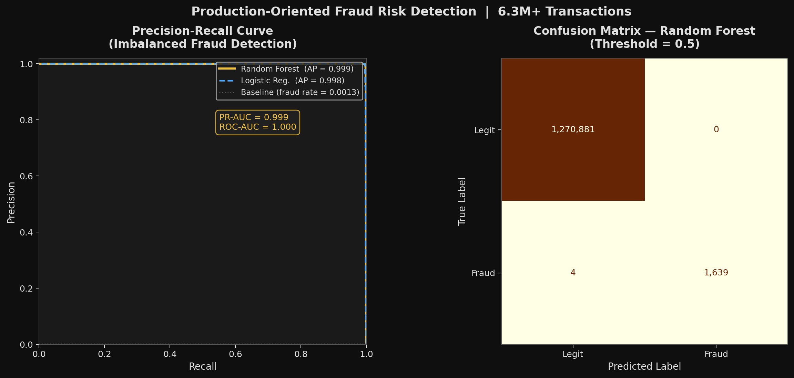
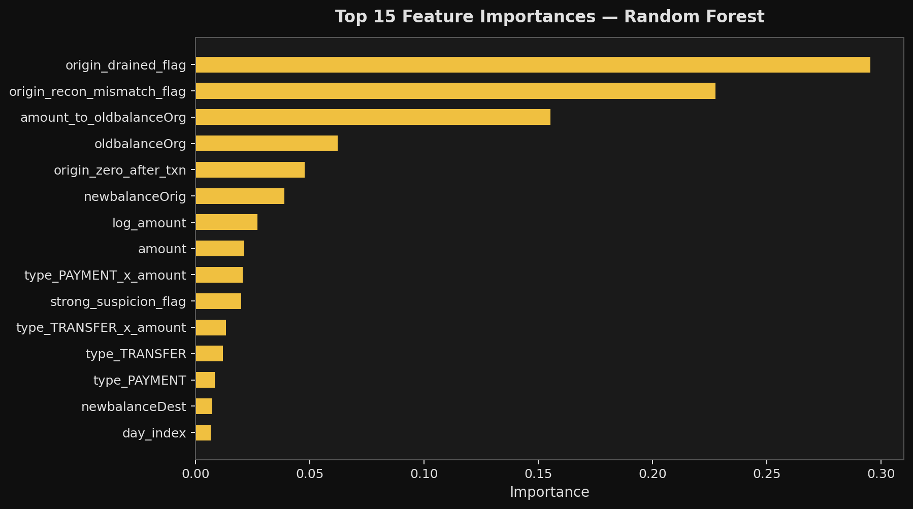

# Production-Oriented Fraud Risk Detection System

> Detecting financial fraud across 6.3M+ transactions | PR-AUC: 0.999 | Random Forest & Logistic Regression | Python, Scikit-learn, Pandas

## Business Problem

Financial fraud costs institutions billions annually. The core challenge isn't just building a model - it's building one that:

- Works on severely imbalanced data (only 0.13% fraud rate)
- Doesn't leak future information into training (a common real-world failure)
- Is explainable and defensible to risk and compliance teams
- Can scale to millions of transactions in production

This project addresses all four.

---

## Results

| Metric | Logistic Regression (Baseline) | Random Forest (Final Model) |
|--------|-------------------------------|----------------------------|
| PR-AUC | 0.980 | **0.999** |
| ROC-AUC | 0.999 | **0.9991** |
| Precision (Fraud) | 1.00 | **1.00** |
| Recall (Fraud) | 1.00 | **1.00** |
| Missed Frauds | — | **4 out of 1,643** |
| False Positives | — | **0** |

**Why PR-AUC over Accuracy?** With a 0.13% fraud rate, a model predicting everything as legitimate would achieve 99.87% accuracy — making accuracy meaningless. PR-AUC directly measures performance on the rare fraud class.

---

## Pipeline Architecture

```
data/raw/
└── AIML Dataset.csv          ← 6.3M+ transactions

src/
├── step_01_ingest_raw_data.py        ← Load & verify raw dataset
├── step_02_validate_data.py          ← Schema checks, null analysis, balance reconciliation
├── step_03_feature_engineering.py    ← 4 categories of fraud-specific features
├── step_04_train_test_split.py       ← Leakage-controlled 80/20 stratified split
└── step_05_model_development.py      ← Model training, evaluation & visualisation

outputs/
├── fraud_model_evaluation.png        ← PR-AUC curve + Confusion Matrix
└── fraud_feature_importance.png      ← Top 15 feature importances
```

---

## Feature Engineering (Step 3)

Four categories of fraud-specific features were engineered:

### 1. Amount Behaviour
- `amount_to_oldBalanceOrg` - transaction size relative to origin balance
- `origin_zero_after_txn` - flags accounts drained to zero (common fraud pattern)
- `origin_drained_flag` - precise drain detection with float tolerance
- `log_amount` - log transform to handle heavy amount skew

### 2. Time Behaviour
- `hour_of_day` - proxy for transaction timing patterns
- `day_index` - groups transactions into day windows
- `is_weekend_proxy` - weekend transaction flag

### 3. Interaction Features
- `type_x_amount` - transaction type crossed with amount (e.g. TRANSFER at high amounts is high risk)

### 4. Signal Amplification
- `high_amount_flag` - 99th percentile threshold flag
- `origin_recon_mismatch_flag` - balance reconciliation anomaly detection
- `dest_recon_mismatch_flag`- destination balance anomaly detection
- `strong_suspicion_flag` - composite flag combining strongest signals

---

## Leakage Prevention (Step 4)

A major real-world ML failure mode is **data leakage** - accidentally training on information that wouldn't be available at prediction time.

The following columns were explicitly excluded from features:
- `isFlaggedFraud` - would leak label information
- `nameOrig`, `nameDest` - no predictive signal, privacy risk
- `oldBalanceOrg` - used only for time-based split logic

**Stratified split** ensures the 0.13% fraud rate is preserved in both train and test sets.

---

## Models

**Baseline - Logistic Regression**
- `class_weight="balanced"` to handle imbalance
- StandardScaler applied
- Establishes minimum performance benchmark

**Primary Model - Random Forest**
- 200 estimators, max depth 12
- `class_weight="balanced"`
- No scaling required
- Evaluated on held-out 20% test set

---

## Visualisations

### PR-AUC Curve + Confusion Matrix


### Top 15 Feature Importances


---

## Tech Stack

| Tool | Purpose |
|------|---------|
| Python 3.13 | Core language |
| Pandas | Data manipulation |
| NumPy | Numerical operations |
| Scikit-learn | ML models, metrics, splitting |
| Matplotlib | Visualisation |

---

## How to Run

```bash
# 1. Clone the repo
git clone https://github.com/samplerittgithub/fraud-risk-detection.git
cd fraud-risk-detection

# 2. Create and activate virtual environment
python -m venv venv
source venv/bin/activate        # Mac/Linux
venv\Scripts\activate.ps1       # Windows

# 3. Install dependencies
pip install pandas numpy matplotlib scikit-learn

# 4. Add your dataset
# Place AIML Dataset.csv in data/raw/

# 5. Run pipeline in order
python src/step_01_ingest_raw_data.py
python src/step_02_validate_data.py
python src/step_03_feature_engineering.py
python src/step_04_train_test_split.py
python src/step_05_model_development.py
```

---

## Key Design Decisions

1. **PR-AUC as primary metric** - accuracy is misleading on 0.13% fraud rate data
2. **Leakage-controlled split** - columns excluded that would not exist at prediction time
3. **Stratified split** - preserves fraud rate in both train/test sets
4. **class_weight="balanced"** - handles imbalance without synthetic oversampling
5. **Modular pipeline** - each step is independently runnable and auditable
6. **Feature explainability** - importance scores make model defensible to compliance teams
